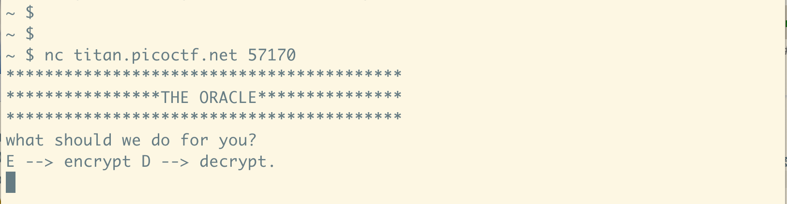
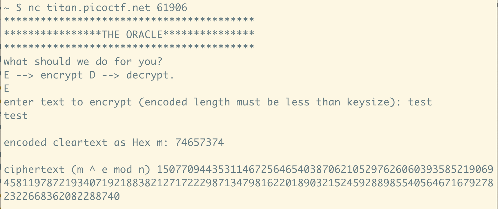

+++
title = 'picoCTF [crypto] writeup 1'
date = 2024-08-15T22:26:17+09:00
draft = false
+++

目次

- [interencdec](#interencdec-easy)
- [Mod 26](#mod-26-easy)
- [The Numbers](#the-numbers-easy)
- [13](#13-easy)
- [rsa_oracle](#rsa_oracle-medium)

## interencdec [Easy]

### Overview

>Can you get the real meaning from this file.

enc_flag が与えられます.

```
YidkM0JxZGtwQlRYdHFhR3g2YUhsZmF6TnFlVGwzWVROclh6ZzVNR3N5TXpjNWZRPT0nCg==
```

上記の文字列を解読する問題です.

### Solution

最後に=があるため, enc_flagはBase64でエンコードされた文字列だと思われます. (Base64ではエンコード後の文字列の長さが4の倍数になるように=を足して調整をします)   
Base64デコードをしてみます.

```
$ cat enc_flag | base64 -d
b'd3BqdkpBTXtqaGx6aHlfazNqeTl3YTNrXzg5MGsyMzc5fQ=='
```

どうやらもう一度Base64デコードする必要があるようです.

```
$ echo "d3BqdkpBTXtqaGx6aHlfazNqeTl3YTNrXzg5MGsyMzc5fQ==" | base64 -d
wpjvJAM{jhlzhy_k3jy9wa3k_890k2379}
```

```wpjvJAM{jhlzhy_k3jy9wa3k_890k2379}```という文字列が得られました. 答えがpicoCTF{...}という形であることを考えると, おそらく[換字式暗号](https://ja.wikipedia.org/wiki/%E6%8F%9B%E5%AD%97%E5%BC%8F%E6%9A%97%E5%8F%B7)だろうと予想できます. p->w, i->pがそれぞれ7文字シフトであることから, 換字式暗号の中でも特に[シーザー暗号](https://ja.wikipedia.org/wiki/%E3%82%B7%E3%83%BC%E3%82%B6%E3%83%BC%E6%9A%97%E5%8F%B7)を考えれば良さそうです.  

Pythonで実装をしました.
```python
ciphertext = "wpjvJAM{jhlzhy_k3jy9wa3k_890k2379}"

def caesar(text, shift):
    result = ""
    for c in text:
        if c.isupper():
            result += chr((ord(c) - ord('A') + shift) % 26 + ord('A'))
        elif c.islower():
            result += chr((ord(c) - ord('a') + shift) % 26 + ord('a'))
        else:
            result += c
    return result

print(caesar(ciphertext, -7))
```

フラグが得られました！

```picoCTF{caesar_d3cr9pt3d_890d2379}```

## Mod 26 [Easy]

### Overview

>Cryptography can be easy, do you know what ROT13 is? 
>cvpbPGS{arkg_gvzr_V'yy_gel_2_ebhaqf_bs_ebg13_nSkgmDJE}

```cvpbPGS{arkg_gvzr_V'yy_gel_2_ebhaqf_bs_ebg13_nSkgmDJE}```を解読する問題です.

### Solution

[ROT13](https://ja.wikipedia.org/wiki/ROT13)とあるので13文字シフトさせればよさそうです.

```python
ciphertext = "cvpbPGS{arkg_gvzr_V'yy_gel_2_ebhaqf_bs_ebg13_nSkgmDJE}"

def caesar(text, shift):
    result = ""
    for c in text:
        if c.isupper():
            result += chr((ord(c) - ord('A') + shift) % 26 + ord('A'))
        elif c.islower():
            result += chr((ord(c) - ord('a') + shift) % 26 + ord('a'))
        else:
            result += c
    return result

print(caesar(ciphertext, 13))
```

フラグが得られました！

```picoCTF{next_time_I'll_try_2_rounds_of_rot13_aFxtzQWR}```

## The Numbers [Easy]

### Overview

>The numbers... what do they mean?

以下の画像が与えられます.


### Solution

換字式暗号っぽいです.  
出てくる数字が$1$から$25$であることから, アルファベットと数字を対応させてそうで, 実際に```1->A, 2->B, 3->B, ..., 26->Z```という対応を考えることで解読することができます.

Pythonで実装をしました.

```python
cipher = [16, 9, 3, 15, 3, 20, 6, 20, 8, 5, 14, 21, 13, 2, 5, 18, 19, 13, 1, 19, 15, 14]

flag = ''.join([chr(ord('A') + i - 1) for i in cipher])
print(flag[:7] + '{' + flag[7:] + '}')
```

フラグが得られました！

```PICOCTF{THENUMBERSMASON}```

## 13 [Easy]

### Overview

>Cryptography can be easy, do you know what ROT13 is?  
>cvpbPGS{abg_gbb_onq_bs_n_ceboyrz}

### Solution

[Mod 26](#mod-26-easy)と同じ問題です. アルファベットを13文字シフトさせます.

```python
ciphertext = "cvpbPGS{abg_gbb_onq_bs_n_ceboyrz}"

def caesar(text, shift):
    result = ""
    for c in text:
        if c.isupper():
            result += chr((ord(c) - ord('A') + shift) % 26 + ord('A'))
        elif c.islower():
            result += chr((ord(c) - ord('a') + shift) % 26 + ord('a'))
        else:
            result += c
    return result

print(caesar(ciphertext, 13))
```

フラグが得られました！

```picoCTF{not_too_bad_of_a_problem}```

## rsa_oracle [Medium]

### Overview

>Can you abuse the oracle?  
>An attacker was able to intercept communications between a bank and a fintech company. They managed to get the message (ciphertext) and the password that was used to encrypt the message.  
>Additional details will be available after launching your challenge instance.

password.encとsecret.encが与えられます.  
マシンに接続して解くタイプの問題で, 接続するとより詳細な情報が得られるようです.  
マシンに接続すると, 追加で説明が入ります.

### Solution

まず配布されるpassword.encとsecret.encの中身を確認します.

```
$ cat password.enc
4228273471152570993857755209040611143227336245190875847649142807501848960847851973658239485570030833999780269457000091948785164374915942471027917017922546%
$ cat secret.enc
Salted__�rF7�]�{O�e3L�b�A��h��,�Ո;u{�^�a��X�7�0��ծ0���2|l8O&7%
```

password.encには整数が入っています. 問題名にrsaが入っているので, パスワードをRSAで暗号化したものっぽいです.  
secret.encが文字化けしていてよくわからないのでfileコマンドでさらに調べます.

```
$ file secret.enc
secret.enc: openssl enc'd data with salted password
```

どうやらsecret.encはOpenSSLを使用してsalted passwordで暗号化されたファイルのようです.  
まずはpassword.encを復号し, それを用いてsecret.encを復号すればよさそうです.

さらなる情報を求めて, マシンに接続します.



encrypt(暗号化)モードとdecrypt(復号化)モードがあるようです. 

**暗号化モード**

暗号化モードでは, 入力された文字列をRSAで暗号化し結果を返します.



具体的には, 入力された文字列mを整数$M$に変換した後に公開鍵$e, n$を使用して$M^e\pmod n$を計算して結果を返します.

**復号化モード**

復号化モードは暗号化モードの逆で, 暗号文を入力すると復号した結果を返してくれます.  

RSAで暗号化されたpassword.encを復号することが目標です.  

